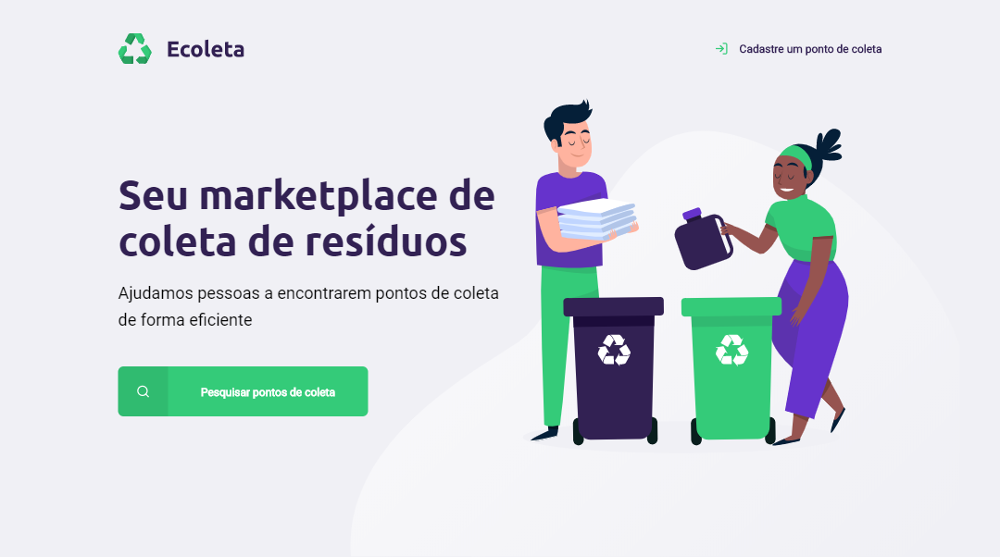
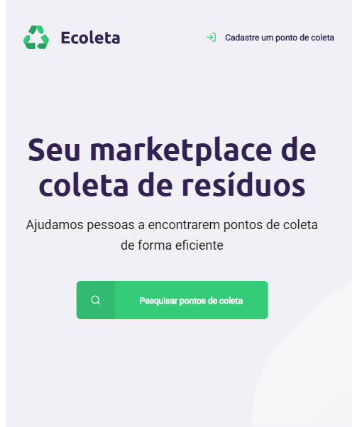
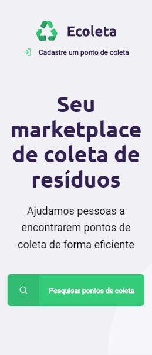
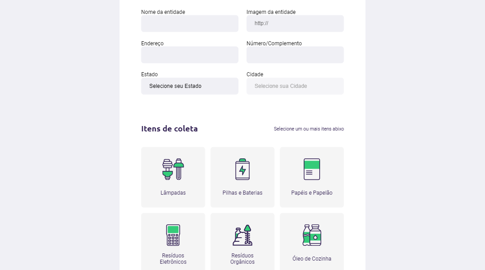
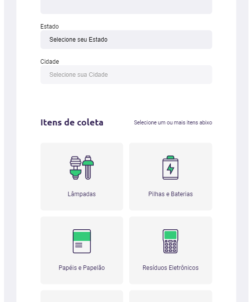
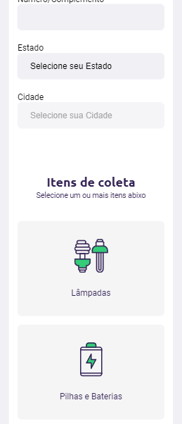
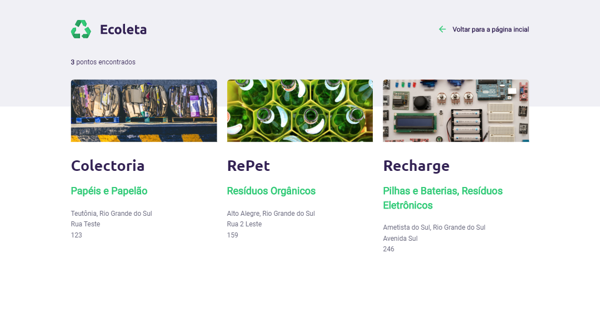
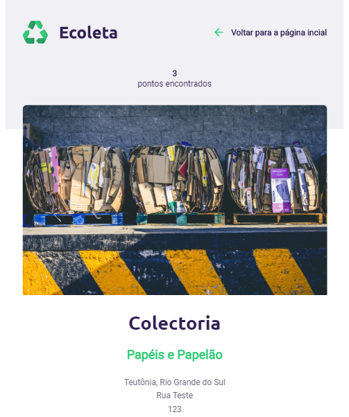
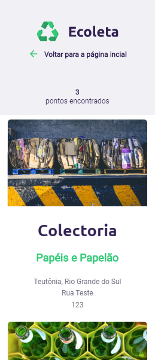
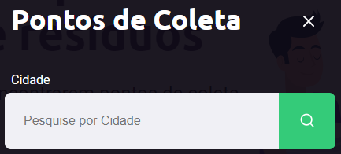

# [Ecoleta](https://ecoleta-djoni.herokuapp.com)

Projeto Ecoleta feito durante a 1° temporada da Next Level Weak, dos dias 1 a 5 de junho, organizado pela [@Rocketseat](https://github.com/Rocketseat). Tem como funcionalidade ser um marketplace para ONG's coletoras de resíduos, facilitando a reciclagem entre a população.

***

## Tecnologias usadas:
#### FrontEnd:
  * [JavaScript](https://javascript.com)
  * [HTML5](https://developer.mozilla.org/pt-BR/docs/Web/HTML)
  * [CSS3](https://developer.mozilla.org/pt-BR/docs/Web/CSS)

#### BackEnd:
  * [Express](https://expressjs.com/pt-br)
  * [Nodemon](https://nodemon.io)

#### Template Engine:
  * [Nunjucks](https://mozilla.github.io/nunjucks)

#### Banco de Dados:
  * [SQLite3](https://sqlite.org)

#### API:
  * [IBGE](https://servicodados.ibge.gov.br/api/docs/localidades)

## Funcionalidades trabalhadas
  * [Cadastro](#tela-criar-ponto) de entidades
  * [Uso de API](#api) do IBGE para classificação dos estados e cidades
  * [Pesquisa](#modal-de-pesquisa) a partir da cidade
  * [Listagem](#tela-resultados-da-pesquisa) de resultados puxados do banco de dados
  * [Responsividade](#imagens) para todas as telas

***

## Para iniciar:
> * `npm install`

Após o comando acima executar:
*(executar apenas um dos comandos abaixo)*

> * `npm start` **→** para abrir **sem** o nodemon
>
> * `npm dev` **→** para abrir **com** o nodemon

***

## Imagens:
### Tela [Inicial](https://ecoleta-djoni.herokuapp.com):

  
  
  

### Tela [Criar Ponto](https://ecoleta-djoni.herokuapp.com/crair-ponto):

  
  
  

### Tela [Resultados da Pesquisa](https://ecoleta-djoni.herokuapp.com):

  
  
  

### Modal de Pesquisa:
  

***

<table>
    <tr align="center">
        <td>
            Código
        </td>
        <td>
            Instrutor
        </td>
    </tr>
    <tr align="center">
        <td>
            
        </td>
        <td>
            
        </td>
    </tr>
    <tr align="center">
        <td>
            <a href="https://github.com/djonibourscheid">@djonibourscheid</a>
        </td>
        <td>
            <a href="https://github.com/maykbrito">@maykbrito</a>
        </td>
    </tr>
</table>

[@Rocketseat](https://github.com/Rocketseat)

